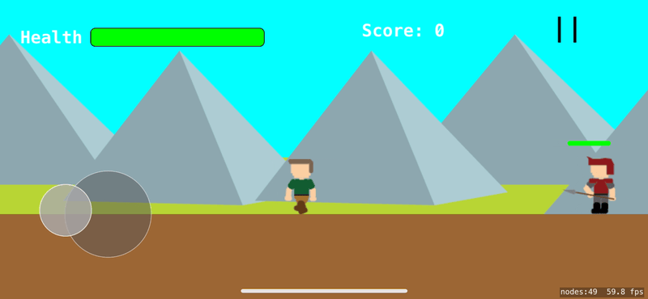

#  RockMagic

A 2D side-scrolling action game for iOS built with Swift and SpriteKit, featuring a dynamic physics based combat system. **This project is currently in a private beta test via TestFlight.**

## Key Features

* **Physics-Driven Combat System:** Implemented a dynamic combat system where players summon and launch multi-part, physics-enabled boulders. The force and damage of impacts are scaled based on the boulder's size, and contextual magic allows for advanced moves like a "boulder jump."

* **Manager-Based Architecture:** Engineered a clean and scalable codebase using the Manager pattern (`AnimationManager`, `MagicManager`, etc.) and the Singleton pattern (`GameManager`) to separate concerns and manage global game state.

* **Scrolling World & Parallax:** Built a robust `worldNode` system to create an expansive, side-scrolling world, complete with a multi-layered parallax background that provides a professional sense of depth.

* **Dynamic UI & State Management:** Developed a complete UI and game state system, including a main menu, an in-game HUD with real-time health and score, and a full pause/game over loop.

* **Progressive Difficulty:** Created a central `GameManager` that dynamically increases the game's difficulty over time by adjusting enemy health, damage, and spawn rates.

## Tech Stack

* **Language:** Swift
* **Framework:** SpriteKit
* **Tools:** Xcode, Git, GitHub

## How to Build and Run

1. Clone the repository: `git clone https://github.com/YourUsername/RockMagic.git`
2. Open `RockMagic.xcodeproj` in Xcode.
3. Select a target simulator or a connected iOS device.
4. Build and run the project (Cmd + R).
